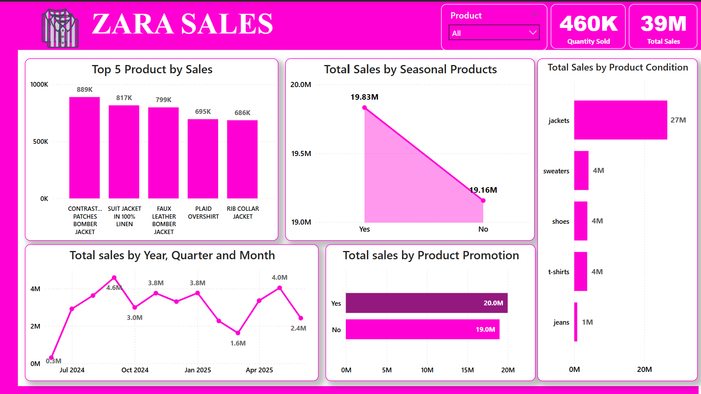
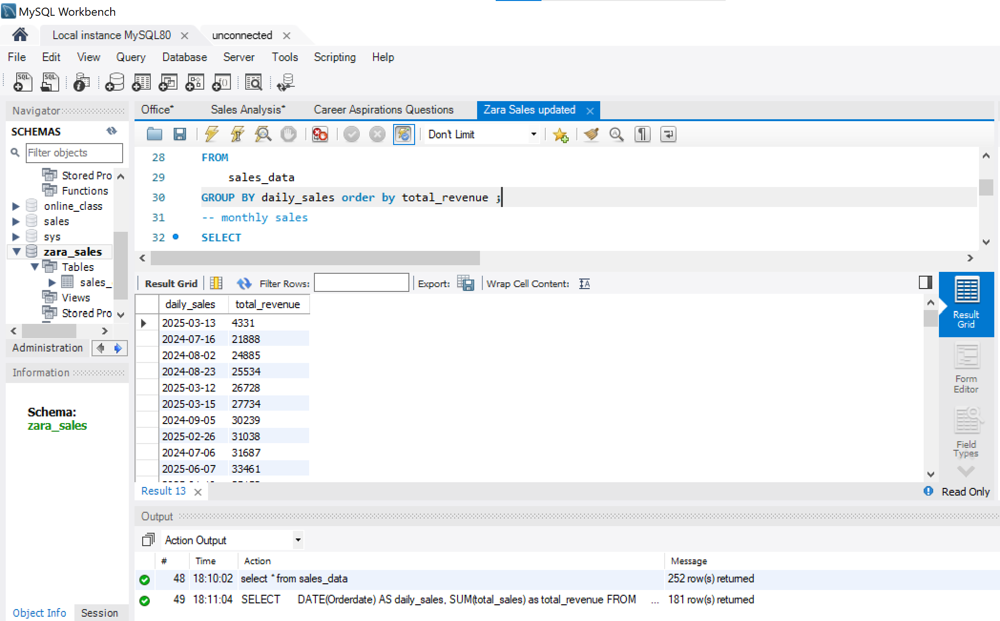
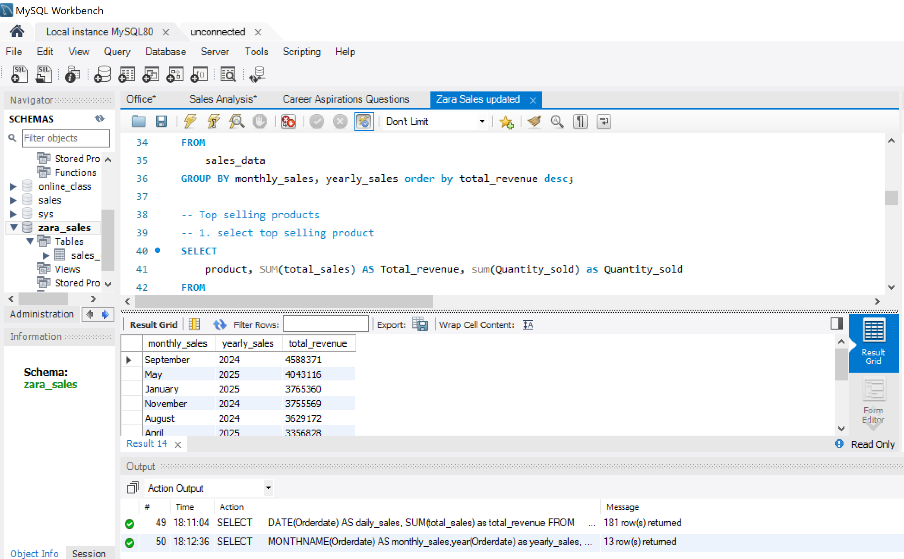
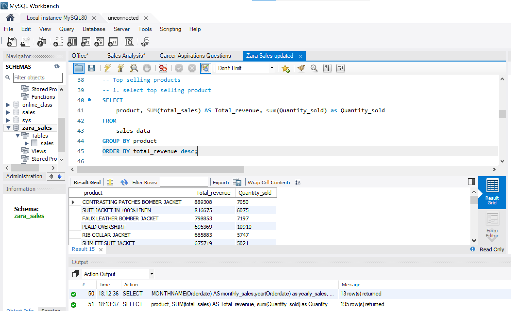
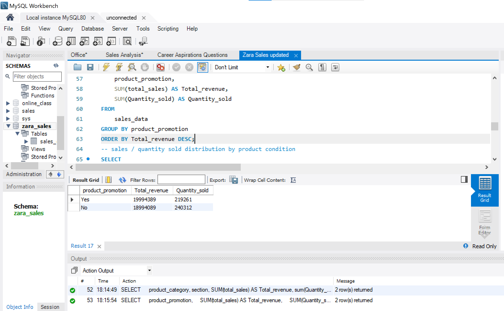
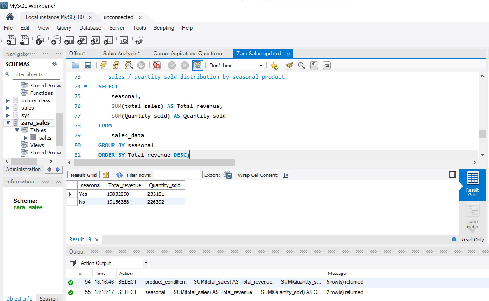
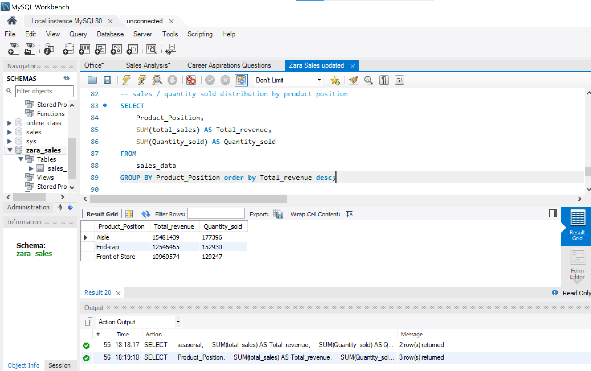
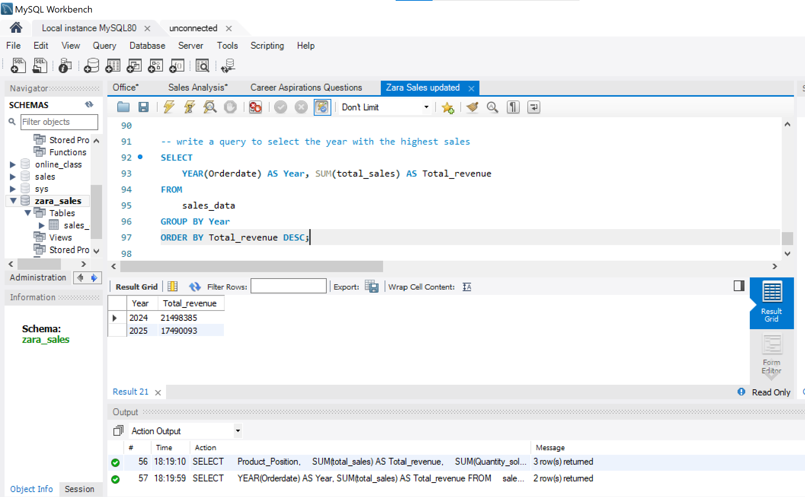

# 📊 ZARA Sales Data Analysis Project

Welcome to my data analytics project focused on exploring and uncovering key business insights from **ZARA's** retail sales dataset. This project leverages **SQL** for data extraction and transformation, and **Power BI** for interactive visual reporting. The objective was to analyze sales performance across various dimensions including product categories, time frames, promotional strategies, and customer behavior patterns.

---

## 🔍 Project Overview

ZARA, a leading global fashion brand, generates massive volumes of sales data. The goal of this project was to:

- Identify **sales trends** by day, month, and year.
- Determine **top-selling products** and product categories.
- Analyze the impact of **promotions**, **product conditions**, and **seasonality** on sales.
- Compare **sales performance across store sections** (men, women) and **product placements** (aisle, back of store, etc.).

*You can access the cleaned dataset [here](https://github.com/ToriAtas/Zara-sales-analysis/blob/main/zaraaaa(cleaned).csv)* 

---

## 🛠️ Tools Used

- **SQL**: For querying and deriving insights from structured data.
- **Power BI**: For building responsive, interactive dashboards.

---

## Visualization 📈

Data visualization was created using power bi with different charts to highlight hidden insights from the data.

# Power BI Dashboard

_You can access and interact with the Power BI dashboard_ [here](https://github.com/ToriAtas/Zara-sales-analysis/blob/main/Zara_sales.pbix)

## 📈 Key Insights

- **Jackets** are the top-performing product category, especially the *Contrast Patches Bomber Jacket*.
- **Seasonal products** outperformed non-seasonal products, indicating stronger sales during specific months.
- **Promotions had little impact** on sales volume, suggesting customers are driven more by product value than discounts.
- The **Men’s section** generated more sales and quantity than the Women’s section.
- Sales peaked in **September 2024** and **May 2025**, showing clear seasonal demand patterns.

---

## 📌 SQL QUERIES AND OUTPUTS
Each section provides the output of the query using simulated sample data and the business insight derived from it.

- ✅ **Sales trends by day, month and year**

  From the result, '2025-05-22' has the highest sales which indicate that the highest sales happened on the 22nd of May 2025 and the least sales happened on the '2025-03-13' which indicate that the least sales occurred on the 13th of March 2025. The column gives total sales of the sales made using orderdate column.
  
- ✅ **Sales by month/year**
  

From the result, September 2024 had highest sales followed by May 2025 with a slight sales difference.
  
- ✅ **Top selling products**
   

From the result, 'CONTRASTING PATCHES BOMBER JACKET' had the highest sales while 'HIGH COLLAR KNIT SWEATER' had lowest sales.

- ✅ **Sales / quantity sold distribution by product promotion**
  

From the result, products that are promoted had highest sales with value of '19994389' and quantity ordered value of '219261', while products that are not promoted had lowest sales and highest quantity ordered with values of '18994089' and '240312' respectively.

- ✅ **Sales / quantity sold distribution by product condition**

Out of the five (5) different product condition available, Jackets had highest sales with value of '26581816' and also highest quantity ordered with value of '259468', while Jeans had lowest sales and quantity ordered with values of '864386' and '13320' respectively.

- ✅ **Sales / quantity sold distribution by product seasonal**
  

From the result, we have two seasons, products that are seasonal are represented as Yes and products that are not seasonal are represented as No. Seasonal products had highest sales with value of '19832090' and highest quantity ordered with value of '233181' while season’s represented with No had a slight difference sales to seasonal products.

- ✅ **Sales / quantity sold distribution by product position**
  

From the result, three (3) products position were available, out of the three Aisle had highest sales and quantity ordered with value of '15481439' and '177396' respectively, while the one at Front of store had lowest sales and lowest quantity ordered with values of '10960574' and '129247' respectively.

- ✅ **Year with the highest sales**
  

From the result two year were available (2024, 2025). 2024 had highest sales with value of '21498385' while 2025 had lowest sales with value of '17490093'.

---

## ✅ Business Impact

This project demonstrates how retail data can inform strategy by:

- Helping prioritize high-performing categories like jackets.
- Aligning marketing efforts with seasonal demand cycles.
- Reassessing the ROI of sales promotions.
- Providing a blueprint for inventory and sales strategy optimization.

---

> **Explore the project files and dashboard to see how data can drive smarter retail decisions.**

## Conclusions

  
The analysis of **ZARA's sales data** highlights clear patterns and trends across product types, time periods, and promotional strategies. Jackets emerged as the highest-selling product category, with the "Contrast Patches Bomber Jacket" leading individual product sales. Seasonal products also performed better in both quantity and value, indicating a strong customer preference for time-relevant fashion. While promotional efforts contributed to sales, the difference between promoted and non-promoted items was minimal, suggesting that promotions may not be the primary driver of purchases. Sales peaked in September 2024 and May 2025, reinforcing the presence of seasonal demand patterns.

## Recommendations

  
1.	**Focus on Jackets:** Since jackets significantly outperform other categories, ZARA should prioritize jacket collections in both men’s and women’s lines, especially around high-performing styles.
2.	**Capitalize on Seasonal Trends:** Invest more in marketing and stock for seasonal products. Align product launches and campaigns with known peak months (e.g., September and May).
3.	**Optimize Promotions:** Reevaluate current promotional strategies, as they show little difference in sales impact. Instead, explore personalized promotions or loyalty-based incentives.
4.	**Boost Underperforming Categories:** Consider revamping or phasing out low-performing categories such as jeans and sweaters unless improvements are made in their designs or marketing.

*By implementing these recommendations, the organization can optimize revenue, enhance customer satisfaction, and improve workforce efficiency, ensuring sustained growth and profitability.* 🙂

